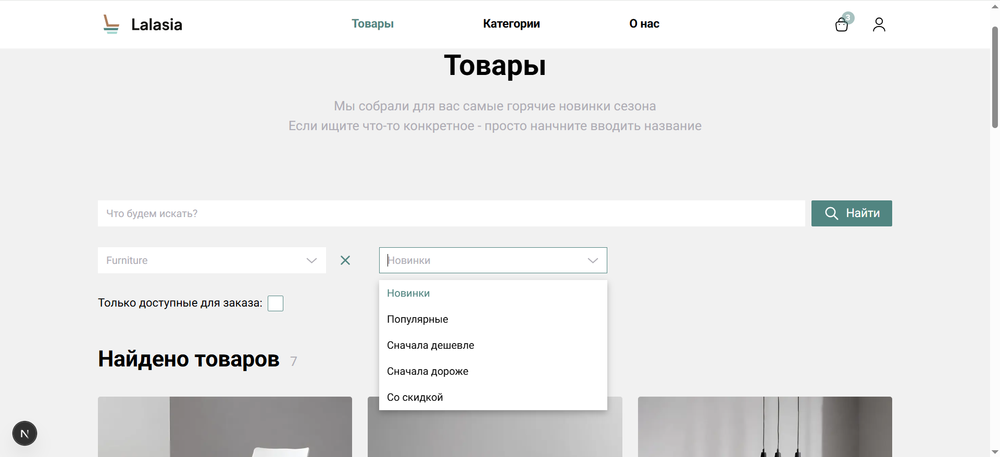
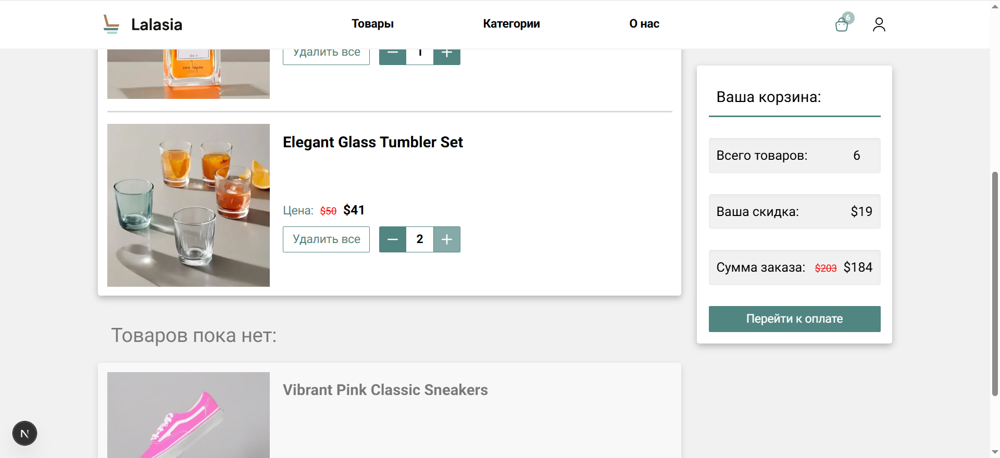
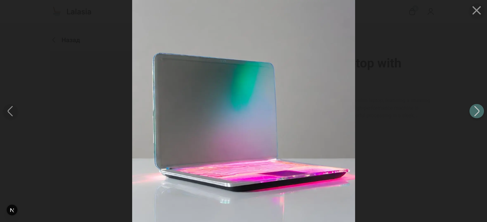
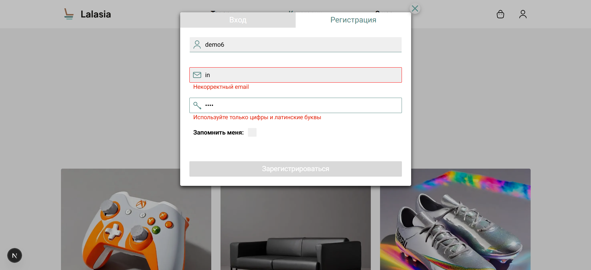
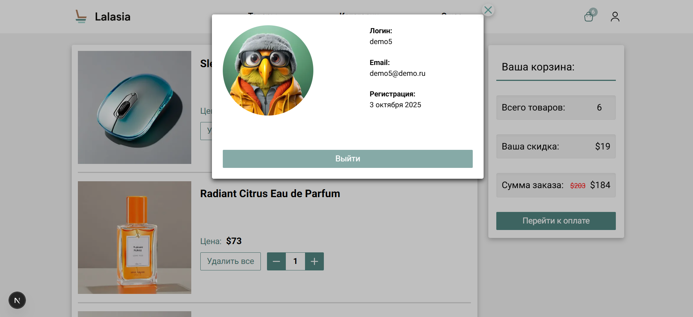
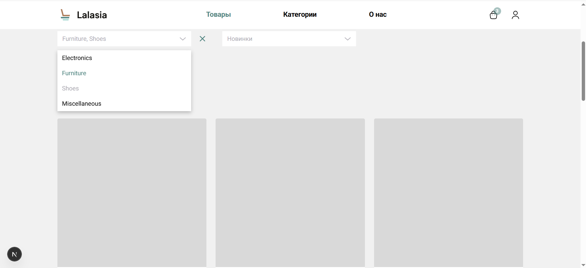

# 🛍️ Lalasia - онлайн-магазин  
  
Проект создан на курсе KTS React-разработчик.  
В проекте используются Next.js, MobX и TypeScript.  
Так же добавлен небольшой Service Worker для кэширования статических запросов и страницы offline.    
  
  

## 🚀 Как установить  
  
  
*Главная страница и каталог товаров*
  
### Основные команды
`yarn install`   # Установка зависимостей  
`yarn dev`       # Запуск проекта в dev-режиме (с Turbopack)  
`yarn build`     # Сборка проекта для деплоя  
  

### Настройка окружения  
После установки создайте файл .env в корне проекта и укажите в нём:  
`NEXT_PUBLIC_API_BASE_URL=https://front-school-strapi.ktsdev.ru/api`  
  
  
  
### Ссылки  
**Продакшен:**   https://next-commerce-tj7e.vercel.app/  
**Репозиторий:** https://github.com/MaxKrch/next-commerce  
  
## ⚙️ Технологии проекта  
  
  
*Корзина - приватный роут*  
  
**Next.js**        Серверный рендеринг улучшает скорость и SEO, что особенно важно для e-commerce  
**MobX**           Реактивное хранение состояния: интерфейс мгновенно реагирует на действия пользователя  
**Service Worker** Кэширование статических ресурсов повышает скорость загрузки, а оффлайн-режим - улучшает "пользовательский опыт" при нестабильном интернете  
**Module.scss**    Позвляет максимально гибко настраивать стили и внешнйи вид приложения  
**TypeScript**     Повышает надежность кода — меньше риск багов в продакшене  
  

### 🧩 Что умеет приложение  
  
  
*Галерея изображений - простая, но легкая и быстрая*  
  
**Поиск и фильтры**: несколько фильтров для точного посика товаров, мгновенный запрос новых товаров при смене фильтра - и отложенный при вводе текста  
**Корзина**: добавление, удаление, изменение количества товаров. Оптимистичное обнолвение интерфейса, синхронизация с сервером - с дебаунсом и откатом измененйи при ошибке  
**Регистрация и вход**: простая регистарция и авторизация  
**Галерея изображений товаров**: мини-превью и просмотр в большом размере  
**Оффлайн-страница и кэширование**: сервис-воркер кэширует статичные запросы, а при остуствии интернета показывает кастомную offline страницу  
**Адаптивный интерфейс**: mobile-first для экранов любой ширины  
  

### 🧱 Как проект устроен  
  
  
*Форма для логина и регистрации с RHF и Zod*  
  
src/  
├── app/                     # Лэйауты, страницы и уникальные компоненты  
│   └── providers/           # Провайдеры стора, модалок и сервис-воркера  
├── shared/  
│   ├── api/                 # Классы и утилиты для работы с API  
│   ├── components/          # Универсальные UI-компоненты  
│   ├── constants/           # Константы и связанные с ними типы  
│   ├── hooks/               # Общие хуки приложения  
│   ├── services/            # Работа с браузерными API  
│   ├── store/               # MobX сторы и связанные хуки  
│   ├── style/               # Общие стили, переменные, анимации  
│   └── types/               # Общие типы и интерфейсы  
  

### 💡 Еще немного об особенностях  
  
  
*Виджет пользователя - замена личной страницы, пока для последней мало функционала*  
  
* Используется MobX для централизованного хранения состояния и реактивных обновлений  
* Синхронизация параметров фильтров с URL через QueryParamsStore  
* Приватные маршруты через компонент PrivateRoute  
* Сервис-воркер кэширует статичные файлы и показывает страницу offline.html при потере соединения  
* Вынесенные провайдеры контекста для стора, модальных окон и сервис-воркера  
  

### 🔧 Что стоит улучшить  
  
  
*Пример скелетона - одна анимация на карточку для оптимизации*  
  
**Технически:**  
* Расширить QueryStore - добавить хранение path для более удобной навигации и синхронизации приложения
* Хранить корзину в idb для быстро начальной загрузки
* Кэшировать динамические запросы для стабильности при слабом интернете
* Добавить тест (unit + e2e)

**Функционально:**
* Добавить API для имитации оплаты заказов
* Улучшить фильтры и сортировку
* Сделать полноценную страницу профиля с подтвержденеим email и сменой пароля

**UX:**
* Добавить возможность работать с корзиной без авторизации
